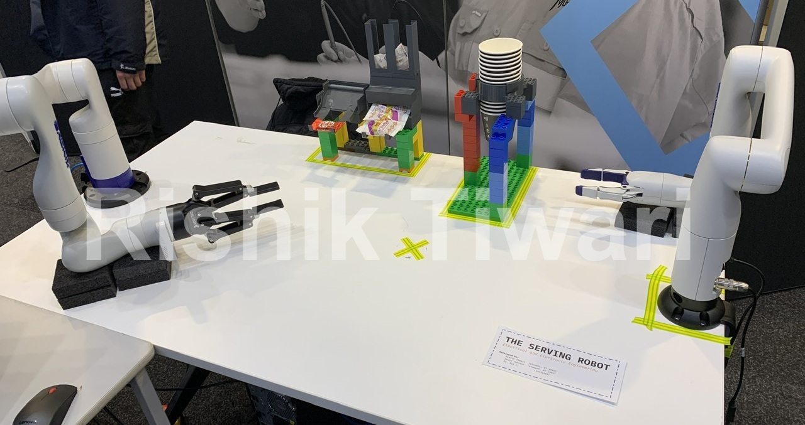

# Dual Kinova Arm Demo

**THE SERVING ROBOT**



[Demo Video](https://www.youtube.com/watch?v=MwPl-zXpSRk)

This demo uses Kinova Gen 3 and Gen 3 Lite arm to serve Kitkat and/or Biscuit in a cup as requested by the user.

The gen 3 lite arm grabs cup from a 3D printed dispenser and places it at a common position on the table.

The gen 3 arm picks kitkat, biscuit from dispenser and drops in the cup one at a time. Once done, the arm slides the cup towards the table edge for human to pick it.

***Overall duration for serving 1 kitkat and 1 biscuit is around 1min 30sec.***

## Setup
+ Gen 3 Lite configured on 192.168.1.10
+ Gen 3 configured on 192.18.1.20
+ ROS 1 (melodic devel)

## Launch
terminal tab #1:
```sh
roslaunch kortex_driver kortex_driver.launch arm:=gen3_lite start_rviz:=false
```

terminal tab #2:
```sh
roslaunch kortex_driver kortex_driver.launch arm:=gen3 dof:=6 vision:=true gripper:=robotiq_2f_140 ip_address:=192.168.1.20 start_rviz:=false
```

terminal tab #3:
```sh
python3 OD_GUI.py
```


